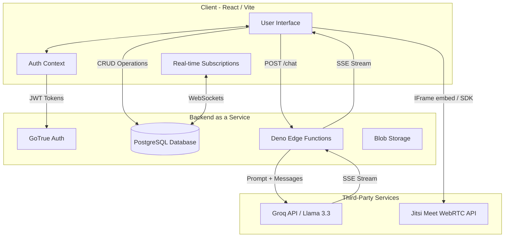

# StudySphere AI: Technical Documentation & Architecture

This document serves as the comprehensive technical reference for the StudySphere AI platform, submitted for the **ByteHearts × Ranovex AI Product Hackathon 2026**.

---

## 1. Comprehensive System Architecture

Below is the complete, detailed architecture diagram illustrating how all subsystems interact:

---

## 2. Database Schema Overview

Our Supabase PostgreSQL database is structured around community-driven learning and mentorship.

*   **`profiles`**: The core user table linked to Supabase Auth. Stores names, roles (student/mentor), skills offered, skills seeking, and bio.
*   **`posts`**: The community feed. Stores questions, resources, and updates. Features full-text search capability.
*   **`comments`**: Replies to community posts.
*   **`connections`**: Tracks peer-to-peer network connections. Uses a status field (`pending`, `accepted`, `rejected`) to manage friend/mentor requests.
*   **`mentor_sessions`**: Handles the scheduling between students and mentors, storing the target time, session type (e.g., Live Call), and acceptance status.

---

## 3. Real-Time Capabilities

We leverage **Supabase Realtime (WebSockets)** to ensure the platform feels alive.
*   **Active Peer Discovery**: The Mentor and Skill Exchange pages optimistic UI patterns, heavily supported by real-time connection status updates.
*   **Instant Feed**: The Opportunities Board / Community feed updates instantly when a peer posts a new resource or asks a question.

---

## 4. AI Tool Usage & Architecture (Compliance)

In accordance with the hackathon's AI Usage Policy, here is the exact breakdown of our AI implementation:

### The Problem
Exposing API keys directly in a React application is a critical security flaw. Furthermore, we needed extremely fast inference for a natural conversational experience.

### The Solution
1.  **Middleware**: We deployed a **Supabase Edge Function** (`studysphere-ai-mentor`) written in Deno. This acts as a secure proxy.
2.  **Model Selection**: We integrate with the **Groq API**, utilizing the `llama-3.3-70b-versatile` model. Groq's LPU architecture provides unparalleled token generation speeds.
3.  **Execution Flow**:
    *   The React client sends an array of chat messages to the Edge Function.
    *   The Edge Function authenticates the request via CORS and Supabase JWTs.
    *   The function securely attaches the `GROQ_API_KEY` (stored securely in Supabase Secrets) and forwards the payload to Groq.
    *   **Streaming**: The response is streamed back via Server-Sent Events (SSE). This means the user sees the AI typing in real-time, drastically reducing perceived latency.

---

## 5. WebRTC Video Integration

For the 1-on-1 mentor calls, we utilized the **Jitsi Meet API**.
*   It operates entirely in the browser without requiring users to download external software (like Zoom or Teams).
*   The architecture allows dynamic room generation based on unique connection IDs between the mentor and the student, ensuring private, secure study sessions.
