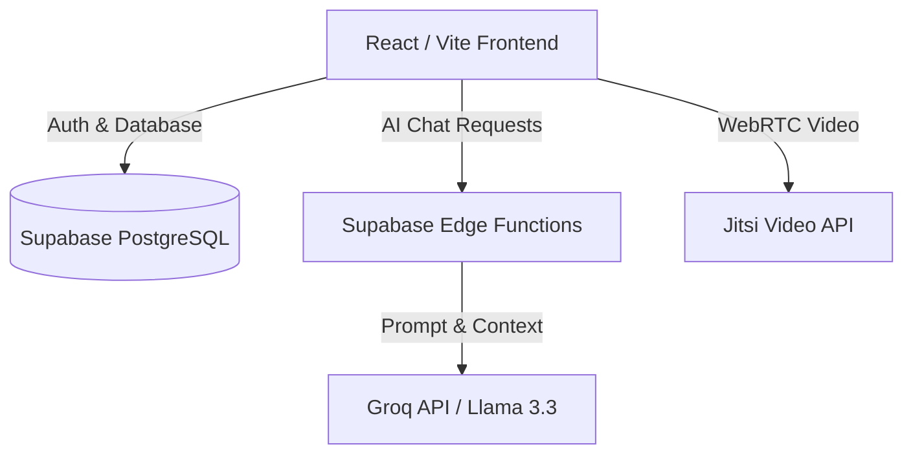

# 🪐 StudySphere AI

> **ByteHearts × Ranovex AI Product Hackathon 2026 Submission**

StudySphere AI is a dedicated workspace for students. We help you stop studying alone by making it easy to find project partners and schedule video calls with mentors.

---

## 🎯 The Problem & Business Value
**The Problem:** Today, students lose time jumping between scattered apps—Discord for chatting, Zoom for calls, and LinkedIn for job hunting. It is difficult to find peers with the specific skills you need for hackathons, and getting advice from seniors often feels intimidating.

**Business Value:** StudySphere fixes this by bringing community chat and mentor scheduling into a single workspace. By reducing the time spent switching between apps, we give students a better chance to finish projects and land jobs.

## 💡 Novelty & Innovation
Unlike Discord (which is mostly for gaming) or LinkedIn (which targets older professionals), StudySphere is built specifically for **students building software and projects**.
- **Smart Teammate Matching:** It actively helps you find students who have the exact skills your team is missing.
- **Instant Video Calls:** We built video calling directly into the browser. You no longer have to create or share messy Zoom links to get help.

---

## ✨ Key Features
- **Skill Exchange:** Find the right peers for your project team, ask coding questions, and share what you know.
- **1-on-1 Mentors:** Book time with seniors or alumni to practice interviews or fix difficult bugs.
- **Live Video:** Talk face-to-face instantly using safe, built-in video rooms.
- **Opportunities Board:** A feed to track current internships and hackathon deadlines.

---

## 🏗 Tech Stack

We focused on using modern tools that let us ship a working, reliable product quickly.

- **Frontend:** React, TypeScript, Vite, Tailwind CSS (for a fast, responsive user interface).
- **Backend & Database:** Supabase (for handling user logins and storing data securely).
- **Integrations:**
  - **AI Integration:** We used the Groq API (llama-3.3-70b-versatile) via Supabase Edge Functions to power a real-time AI Mentor Chatbot.
  - **Video Calling:** We integrated the Jitsi API to handle video calls smoothly in the browser.

### 📐 System Architecture



### 🧠 AI Architecture & Technical Implementation
Here is how our AI integration works under the hood to provide a seamless learning experience:
- **Frontend Interface:** Users interact with a custom-built chat UI in React that manages conversational state.
- **Secure Middleware:** To keep our API keys secure, the frontend sends requests to a backend **Supabase Edge Function** (`studysphere-ai-mentor`).
- **AI Processing:** The Edge function securely communicates with the **Groq API**, utilizing the `llama-3.3-70b-versatile` model. We chose Groq for its ultra-low latency inference, providing a true real-time conversational experience for students.
- **Streaming Response:** The model's output is streamed back to the client in real-time using Server-Sent Events (SSE), ensuring the UI feels fast and responsive.

---

## 🚀 Setup Instructions

Follow these steps to run StudySphere AI locally on your computer.

### Prerequisites
- Node.js (v18 or higher)
- A Supabase account

### Installation
1. **Clone the repository**
   ```bash
   git clone https://github.com/yourusername/studysphere-ai.git
   cd studysphere-ai
   ```

2. **Install dependencies**
   ```bash
   npm install
   ```

3. **Environment Variables**
   Create a `.env.local` file in the main folder and add your Supabase keys:
   ```env
   VITE_SUPABASE_URL=your_supabase_project_url
   VITE_SUPABASE_ANON_KEY=your_supabase_anon_key
   ```

4. **Start the Development Server**
   ```bash
   npm run dev
   ```
   Open your browser and go to `http://localhost:5173`.

---

## 🔮 Future Scope
- **Phase 1 (Current):** Launch the working workspace and onboard our first 100 students.
- **Phase 2:** Connect the app to GitHub so we can automatically verify user skills.
- **Phase 3:** Create private groups for specific universities so alumni can help students directly.

---

## 👥 Team Paradox
- **Kancharla Harika Kalyani** - *Frontend Architecture, UI/UX Design & Product Strategy* (Led React, Tailwind, and Interface Design)
- **Chowdam Purushothamudu** - *Backend Systems, AI Integration & Deployment* (Led Supabase, Groq API, Jitsi WebRTC, and Vercel Deployment)
